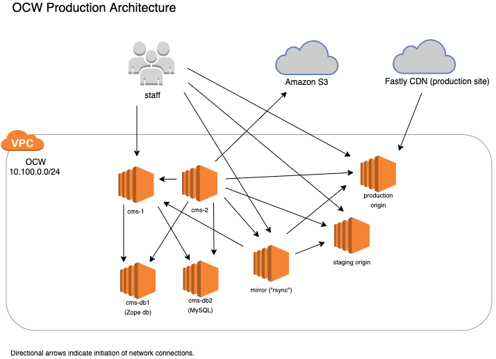
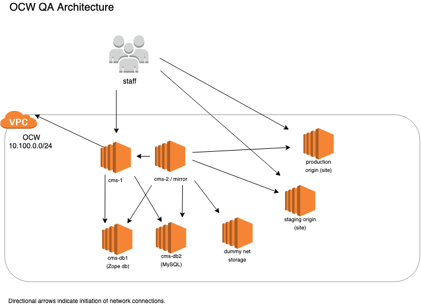

# OpenCourseWare

[Table of Contents](index.md)

## Architecture Overview

This section provides a brief overview of the different classes of servers that make up our OCW infrastructure.

First, some terminology:

The OCW site is a static HTML website that is hosted on **Akamai**'s Content Delivery Network (CDN). The CDN pulls resources from our production origin server when they are updated. A content management system (**CMS**), which runs **Plone** on top of the **Zope** application framework, manages the site content (pages and resources) and is what staff members interact with to maintain and publish content. There is additionally a server (the "**mirror**" or "rsync" server) that hosts a special flattened version of the site that is designed for being `rsync`ed onto a USB drive for physical distribution, and an Akamai object-storage ("**netstorage**" or file storage) service that receives files from the CMS during the publishing process. There are many Python and shell scripts, called **Engine** scripts, which run on one of the CMS servers and copy files to the staging and production **origin servers**, and to the mirror and netstorage destinations. All of the "servers," except for the Akamai ones, are **Amazon EC2 instances**.

There is a **QA environment** and a **Production environment**, composed of mainly the same classes of servers.  For example, QA has a "CMS 1" and "CMS 2" server, and a Zope database server; and Production also has the same equivalent servers.

The diagrams below illustrate (without getting into any implementation details) which servers exist, and the directions in which network connections are formed; which determines which ones have dependencies on the others. For instance, scripts on the **CMS 2** server (the "engine" server) make HTTP and SSH requests to the **CMS 1** and origin servers, but those servers never have scripts or applications that connect to CMS 2. The CMS servers connect to the Zope database but the Zope database doesn't have any dependency on the CMS servers.

## Versions

Zope version: 2.10
Plone version: 3.3.5
Python version for Zope: 2.4.6
Python version for engines and scripts: 2.7.13

## Inventory

See <https://github.mit.edu/odl-engineering/project-status/wiki/App-Links> for the current hostnames and URLs.

***

